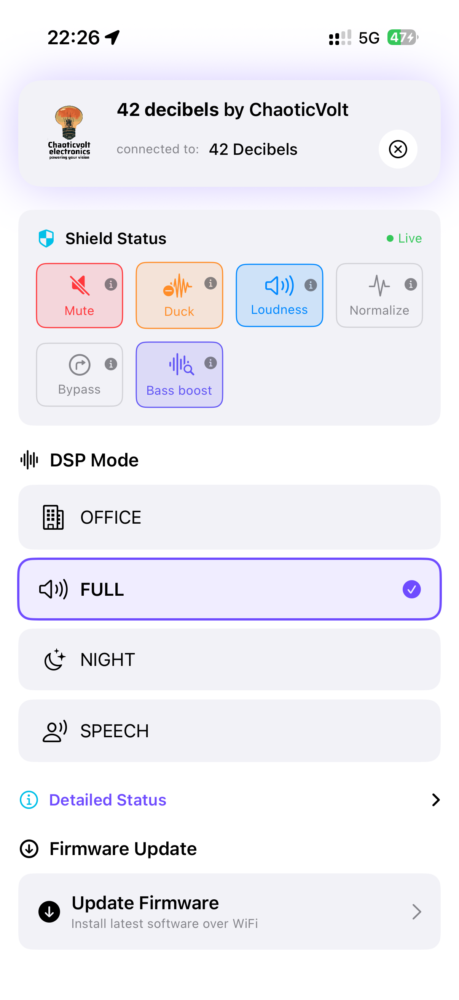

# 42 Decibels iOS App

Official iOS companion app for ChaoticVolt 42 Decibels audio devices.

**Version:** 1.0.1
**Platform:** iOS 15.0+
**Developer:** ChaoticVolt / MYBLtd

---

## Table of Contents

1. [Overview](#overview)
2. [Features](#features)
3. [Getting Started](#getting-started)
4. [Architecture](#architecture)
5. [BLE Protocol](#ble-protocol)
6. [OTA Firmware Updates](#ota-firmware-updates)
7. [User Interface](#user-interface)
8. [Configuration](#configuration)
9. [Troubleshooting](#troubleshooting)
10. [Development](#development)

---

## Overview

42 Decibels is a SwiftUI-based iOS application that provides complete control over ChaoticVolt audio devices via Bluetooth Low Energy (BLE). The app enables users to:

- Connect to and control 42 Decibels speaker devices
- Switch between DSP audio presets
- Monitor real-time device status
- Perform over-the-air (OTA) firmware updates

### Supported Devices

The app automatically filters and connects only to compatible devices:
- Devices advertising Service UUID: `00000001-1234-5678-9ABC-DEF012345678`
- Devices with names starting with: `42 Decibels`, `42DB`, or `ChaoticVolt`

---

## Features

### Bluetooth Connectivity
- **Smart Device Discovery** - Filters scan results to show only compatible devices
- **Stable BLE Connection** - Robust connection management with error handling
- **Auto-reconnection** - Handles disconnections gracefully

### DSP Control
| Preset | Icon | Description |
|--------|------|-------------|
| OFFICE | Building | Balanced sound for office/desk use |
| FULL | Speaker | Full-range audio output |
| NIGHT | Moon | Reduced bass, volume capped at 60% |
| SPEECH | Person | Optimized for voice content |

### Shield Status Controls
Interactive controls for real-time audio processing:

| Control | Function | Description |
|---------|----------|-------------|
| **Mute** | Silence audio | Completely mutes all output |
| **Duck** | Reduce volume | Instantly drops volume to 25% (-12 dB) |
| **Loudness** | Bass boost | Fuller sound at lower volumes |
| **Normalize** | DRC | Dynamic range compression for speech clarity |

### OTA Firmware Updates
- Update device firmware wirelessly over WiFi
- Real-time progress monitoring with download statistics
- Firmware validation and rollback support
- Error recovery with automatic retry for network issues

### User Interface
- ChaoticVolt branded design with purple accent (#6F4CFF)
- Animated splash screen with logo
- Live status indicator showing connection health
- Collapsible detailed status section

---
### Apple Watch app


### iPhone app





---
## Getting Started

### Requirements
- iPhone or iPad running iOS 15.0 or later
- Bluetooth 4.0+ capable device
- 42 Decibels compatible audio device
- WiFi network (2.4GHz) for OTA updates

### First Launch

1. **Enable Bluetooth** - Ensure Bluetooth is enabled on your iOS device
2. **Power on speaker** - Turn on your 42 Decibels device
3. **Open app** - Launch the 42 Decibels app
4. **Connect** - Tap the + button to scan for devices
5. **Select device** - Choose your speaker from the list

### Basic Usage

Once connected:
1. Use the **Shield Status pills** to toggle Mute, Duck, Loudness, and Normalize
2. Select a **DSP Mode** preset for your listening environment
3. Monitor **Detailed Status** for device information
4. Access **Firmware Update** to check for updates

---

## Architecture

### Project Structure

```
42 Decibels/
├── _2_DecibelsApp.swift      # App entry point
├── ContentView.swift          # Main UI and navigation
├── BluetoothManager.swift     # BLE connection and protocol
├── OTAManager.swift           # OTA firmware update logic
├── OTAViews.swift             # OTA-related UI components
├── SplashScreenView.swift     # Animated launch screen
├── GalacticStatusView.swift   # Status display components
└── Assets.xcassets/           # Images and icons
    ├── AppIcon.appiconset/    # App icons
    └── ChaoticVoltLogo.imageset/  # Brand logo
```

### Key Classes

#### `BluetoothManager`
Central manager for all Bluetooth operations.

```swift
@MainActor
class BluetoothManager: NSObject, ObservableObject {
    @Published var discoveredSpeakers: [CBPeripheral] = []
    @Published var connectedSpeaker: CBPeripheral?
    @Published var connectionState: ConnectionState
    @Published var currentPreset: DSPPreset?
    @Published var galacticStatus: GalacticStatus?
    @Published var otaManager: OTAManager
}
```

**Responsibilities:**
- BLE scanning with service UUID filtering
- Connection lifecycle management
- Command encoding and transmission
- Status notification handling
- Galactic Status parsing

#### `OTAManager`
Handles over-the-air firmware updates.

```swift
@MainActor
class OTAManager: NSObject, ObservableObject {
    @Published var status: OTAStatus
    @Published var isUpdating: Bool
    @Published var showingCredentialsSheet: Bool
    @Published var showingValidationDialog: Bool
}
```

**Responsibilities:**
- WiFi credential transmission
- Firmware URL configuration
- OTA control commands (start, cancel, reboot, validate, rollback)
- Progress monitoring and error handling

#### `GalacticStatus`
Comprehensive device status snapshot.

```swift
struct GalacticStatus {
    let protocolVersion: UInt8      // Always 0x42
    let currentQuantumFlavor: UInt8 // Preset ID (0-3)
    let shieldStatus: ShieldStatus  // Bitfield flags
    let energyCoreLevel: UInt8      // Reserved
    let distortionFieldStrength: UInt8  // Volume (0-100)
    let energyCore: UInt8           // Battery (0-100)
    let lastContact: UInt8          // Seconds since BLE activity
    let receivedAt: Date            // iOS timestamp
}
```

---

## BLE Protocol

### Service and Characteristics

| UUID | Name | Properties | Description |
|------|------|------------|-------------|
| `0x0001` | Service | - | Main BLE service |
| `0x0002` | Control Write | Write | Send commands |
| `0x0003` | Status Notify | Notify, Read | Simple status updates |
| `0x0004` | Galactic Status | Notify, Read | Comprehensive status |
| `0x0005` | OTA Credentials | Write | WiFi SSID + password |
| `0x0006` | OTA URL | Write | Firmware download URL |
| `0x0007` | OTA Control | Write | OTA commands |
| `0x0008` | OTA Status | Notify, Read | OTA progress |

### Command Format

All commands are 2-byte packets: `[COMMAND_TYPE, VALUE]`

| Command | Byte 0 | Byte 1 | Description |
|---------|--------|--------|-------------|
| Set Preset | `0x01` | `0x00-0x03` | Change DSP preset |
| Set Loudness | `0x02` | `0x00-0x01` | Toggle loudness |
| Request Status | `0x03` | `0x00` | Request full status |
| Set Mute | `0x04` | `0x00-0x01` | Toggle mute |
| Set Audio Duck | `0x05` | `0x00-0x01` | Toggle volume reduction |
| Set Normalizer | `0x06` | `0x00-0x01` | Toggle DRC |
| Set Volume | `0x07` | `0x00-0x64` | Set volume (0-100) |

### Galactic Status Format

7-byte packet received via notifications:

```
Byte 0: Protocol Version (0x42)
Byte 1: Current Preset (0-3)
Byte 2: Shield Status Bitfield
        - Bit 0: Muted
        - Bit 1: Audio Duck (Panic Mode)
        - Bit 2: Loudness
        - Bit 3: Normalizer/Limiter
Byte 3: Energy Core Level (0-100)
Byte 4: Volume/Distortion Field (0-100)
Byte 5: Battery Level (0-100)
Byte 6: Last Contact (seconds)
```

---

## OTA Firmware Updates

### Overview

The OTA system uses a hybrid BLE+WiFi approach:
1. **BLE** transmits WiFi credentials and control commands
2. **WiFi** downloads the firmware from a server
3. **BLE** monitors progress and handles validation

### OTA Flow

```
┌─────────────────────────────────────────────────────────┐
│ 1. User enters WiFi credentials and firmware URL        │
├─────────────────────────────────────────────────────────┤
│ 2. App sends credentials via BLE (OTA_CREDENTIALS)      │
│    → Device state: CREDS_RECEIVED                       │
├─────────────────────────────────────────────────────────┤
│ 3. App sends firmware URL via BLE (OTA_URL)             │
│    → Device state: URL_RECEIVED                         │
├─────────────────────────────────────────────────────────┤
│ 4. App sends START command (OTA_CONTROL)                │
│    → Device state: WIFI_CONNECTING → WIFI_CONNECTED     │
│    → Device state: DOWNLOADING (with progress updates)  │
│    → Device state: VERIFYING                            │
│    → Device state: SUCCESS                              │
├─────────────────────────────────────────────────────────┤
│ 5. User taps "Reboot Now"                               │
│    → Device reboots, BLE disconnects                    │
├─────────────────────────────────────────────────────────┤
│ 6. Device reconnects with new firmware                  │
│    → Device state: PENDING_VERIFY                       │
├─────────────────────────────────────────────────────────┤
│ 7. User validates or rolls back firmware                │
│    → Device state: IDLE (update complete)               │
└─────────────────────────────────────────────────────────┘
```

### OTA States

| State | Value | Description |
|-------|-------|-------------|
| IDLE | `0x00` | Ready for OTA |
| CREDS_RECEIVED | `0x01` | WiFi credentials received |
| URL_RECEIVED | `0x02` | Firmware URL received |
| WIFI_CONNECTING | `0x03` | Connecting to WiFi |
| WIFI_CONNECTED | `0x04` | WiFi connected |
| DOWNLOADING | `0x05` | Downloading firmware |
| VERIFYING | `0x06` | Verifying firmware |
| SUCCESS | `0x07` | Ready for reboot |
| PENDING_VERIFY | `0x08` | Needs validation |
| ERROR | `0xFF` | Error occurred |

### OTA Errors

| Error | Value | Retryable | Message |
|-------|-------|-----------|---------|
| WIFI_CONNECT | `0x01` | Yes | WiFi connection failed |
| HTTP_CONNECT | `0x02` | Yes | Cannot reach server |
| DOWNLOAD | `0x04` | Yes | Download failed |
| VERIFY | `0x05` | No | Verification failed |
| WRITE | `0x06` | No | Flash write failed |
| INVALID_IMAGE | `0x09` | No | Invalid firmware file |

### Requirements

- **WiFi**: 2.4GHz network (ESP32 limitation)
- **Internet**: Network must have internet access
- **Firmware URL**: HTTPS recommended for security

---

## User Interface

### Main Screen Layout

```
┌─────────────────────────────────────────┐
│ [Logo] 42 decibels by ChaoticVolt       │
│        connected to: Device Name    [X] │
├─────────────────────────────────────────┤
│ Shield Status                    [Live] │
│ ┌─────┬─────┬──────────┬───────────┐   │
│ │Mute │Duck │Loudness  │ Normalize │   │
│ └─────┴─────┴──────────┴───────────┘   │
├─────────────────────────────────────────┤
│ DSP Mode                                │
│ ○ OFFICE                                │
│ ● FULL                        ✓         │
│ ○ NIGHT                                 │
│ ○ SPEECH                                │
├─────────────────────────────────────────┤
│ ▼ Detailed Status                       │
│   Quantum Flavor: FULL                  │
│   Last Contact: Just now                │
│   System Volume: 75%                    │
├─────────────────────────────────────────┤
│ Firmware Update                         │
│ [→] Update Firmware                     │
│     Install latest software over WiFi   │
└─────────────────────────────────────────┘
```

### Color Scheme

| Element | Color | Hex |
|---------|-------|-----|
| Brand accent | Purple | `#6F4CFF` |
| Mute | Red | System red |
| Duck | Orange | System orange |
| Loudness | Blue | System blue |
| Normalize | Green | System green |
| Live indicator | Green | System green |

### Visual Feedback

- **Orange overlay**: Appears when Audio Duck is active
- **Live indicator**: Green dot when device is responding
- **Haptic feedback**: Light impact on button taps
- **Scale animation**: Buttons scale down on press

---

## Configuration

### Entitlements

The app requires the following entitlements for full functionality:

```xml
<!-- 42 Decibels.entitlements -->
<key>com.apple.developer.networking.wifi-info</key>
<true/>
```

**Note**: WiFi auto-detection requires a paid Apple Developer account. The feature is currently disabled in the codebase until enrollment is approved.

### Build Settings

| Setting | Value |
|---------|-------|
| Deployment Target | iOS 15.0 |
| Swift Version | 5.0 |
| Supported Devices | iPhone, iPad |

### Device Name Filtering

To add support for additional device names, edit `BluetoothManager.swift`:

```swift
private let validDeviceNamePrefixes = [
    "42 Decibels",
    "42DB",
    "ChaoticVolt",
    // Add additional prefixes here
]
```

---

## Troubleshooting

### Connection Issues

**Device doesn't appear in scan**
1. Verify device is powered on and in pairing mode
2. Check that device advertises the correct service UUID
3. Use debug mode: `bluetoothManager.startScanning(showAllDevices: true)`
4. Verify device name matches expected prefixes

**Connection drops frequently**
1. Move closer to the device
2. Check for Bluetooth interference
3. Ensure device firmware is up to date
4. Restart Bluetooth on iOS device

**"Not responding" status**
1. Device is connected but not sending Galactic Status updates
2. Check device-side BLE implementation
3. Verify characteristic notifications are enabled

### OTA Update Issues

**WiFi connection fails**
1. Verify SSID is correct (case-sensitive)
2. Check password (max 64 characters)
3. Ensure network is 2.4GHz (ESP32 limitation)
4. Verify network has internet access

**Download fails**
1. Check firmware URL is accessible
2. Verify server is online
3. Check device WiFi signal strength (shown in progress view)
4. Try HTTPS URL for better reliability

**Verification fails**
1. Firmware file may be corrupted
2. Device may have insufficient storage
3. Re-download and try again

**Device won't reboot**
1. Disconnect and reconnect BLE
2. Power cycle the device manually
3. Device may auto-rollback after timeout

### Build Issues

**Missing entitlements error**
1. Add "Access WiFi Information" capability in Xcode
2. Ensure signing identity has required permissions

**Simulator issues**
1. BLE features require a real device
2. WiFi detection may not work in Simulator

---

## Development

### Running Tests

```bash
xcodebuild test -scheme "42 Decibels" -destination 'platform=iOS Simulator,name=iPhone 15'
```

### Debug Mode

Enable verbose logging by checking console output for:
- `✅` Success messages
- `❌` Error messages
- `📤` Outgoing BLE commands
- `📥` Incoming BLE data
- `🌌` Galactic Status updates

### Adding New Commands

1. Add command to `BluetoothManager.Command` enum
2. Define the command data format
3. Add public method to `BluetoothManager`
4. Add response parsing if needed

Example:
```swift
private enum Command {
    case newFeature(Bool)

    var data: Data {
        switch self {
        case .newFeature(let enabled):
            return enabled ? Data([0x08, 0x01]) : Data([0x08, 0x00])
        }
    }
}

func setNewFeature(_ enabled: Bool) {
    sendCommand(.newFeature(enabled))
}
```

---

## Support

For issues or questions:
- **Email**: support@chaoticvolt.eu
- **GitHub**: https://github.com/MYBLtd/ChaoticVolt-42_Decibels-iPhone-and-WatchOS-app

---

## Related Projects

This app is one of three projects that form the **42dB audio system**:

| Project | Repository | Role |
|---------|-----------|------|
| **42dB STM32 DSP Engine** | [ChaoticVolt-42dB_STM32_DSP_engine](https://github.com/MYBLtd/ChaoticVolt-42dB_STM32_DSP_engine) | Real-time audio DSP processor |
| **42dB iPhone & Apple Watch App** (this repo) | [ChaoticVolt-42_Decibels-iPhone-and-WatchOS-app](https://github.com/MYBLtd/ChaoticVolt-42_Decibels-iPhone-and-WatchOS-app) | BLE GATT control interface |
| **ESP32 BLE GATT / A2DP firmware** | [ChoticVolt-ESP32_I2S_Master_with_BLE_GATT](https://github.com/MYBLtd/ChoticVolt-ESP32_I2S_Master_with_BLE_GATT) | A2DP Bluetooth sink + GATT relay |

### Version Compatibility

The three projects communicate over a shared **BLE GATT protocol**. When the protocol changes, all three must be updated together:

| Protocol | STM32 DSP Engine | ESP32 Firmware | iPhone/Watch App |
|----------|-----------------|----------------|-----------------|
| v1 | v0.3.0 – v0.5.x | v2.4.1 – v2.4.3 | v1.0.x |

## License

PolyForm Noncommercial 1.0.0 — See [LICENSE.txt](LICENSE.txt). Commercial use requires explicit written permission.

## Author

Robin Kluit

## Maintenance

This repo currently does not accept external pull requests. Please use Issues or Discussions for reports and suggestions.

---

*Documentation last updated: 2026-02-19*
